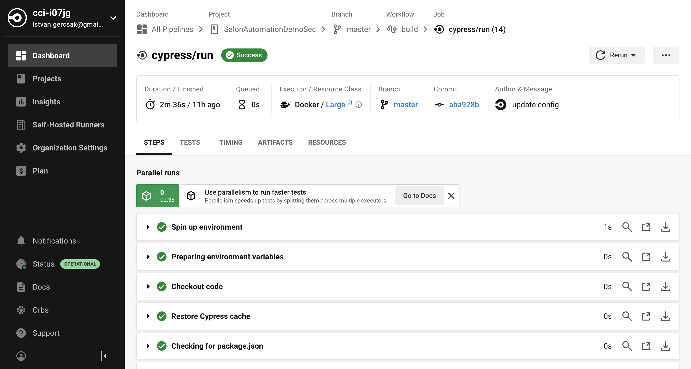
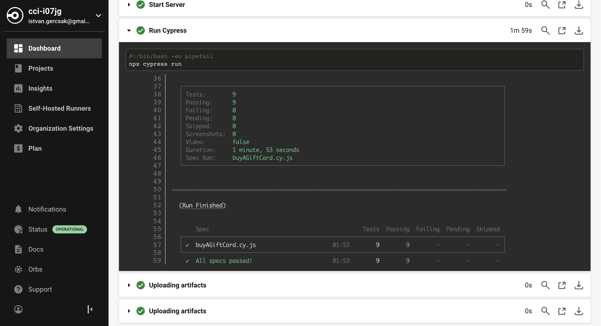
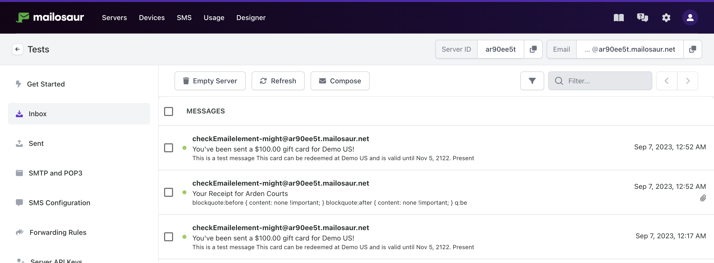
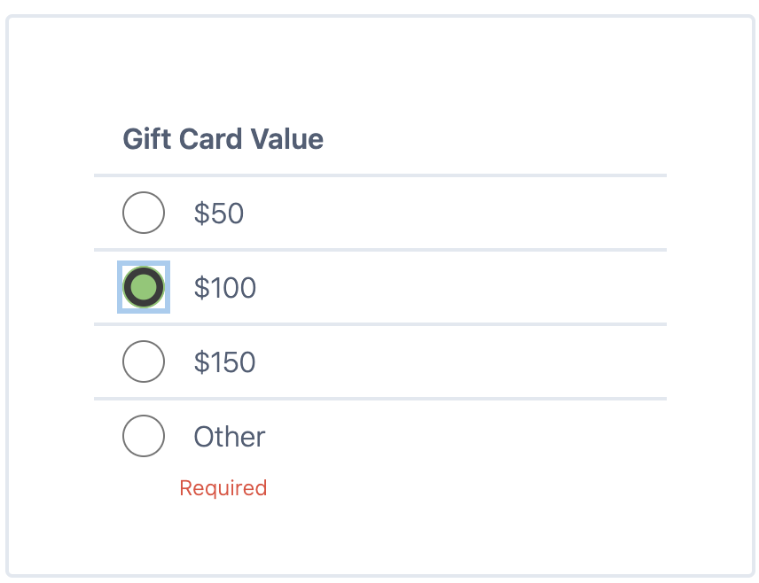
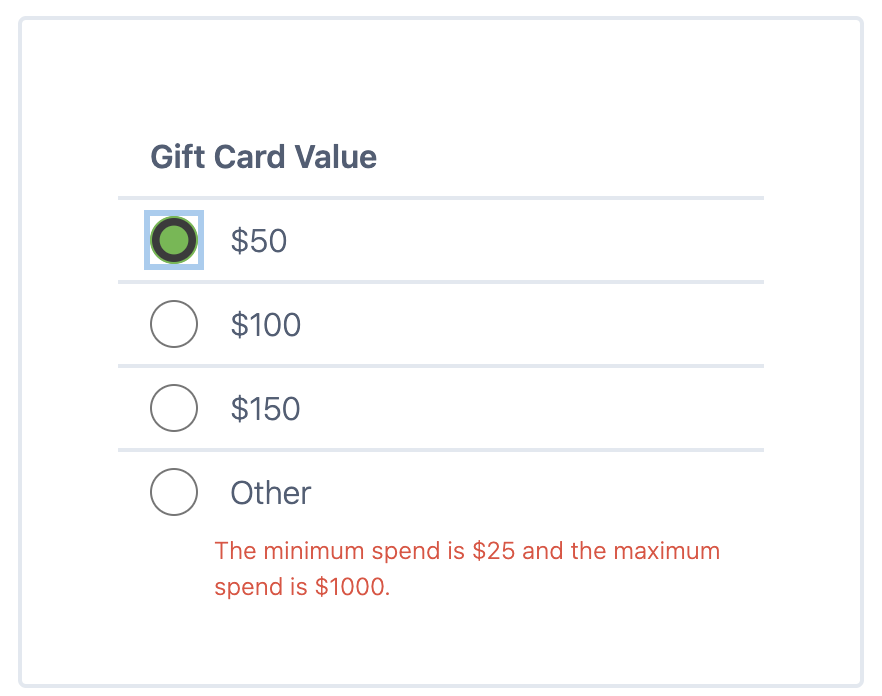
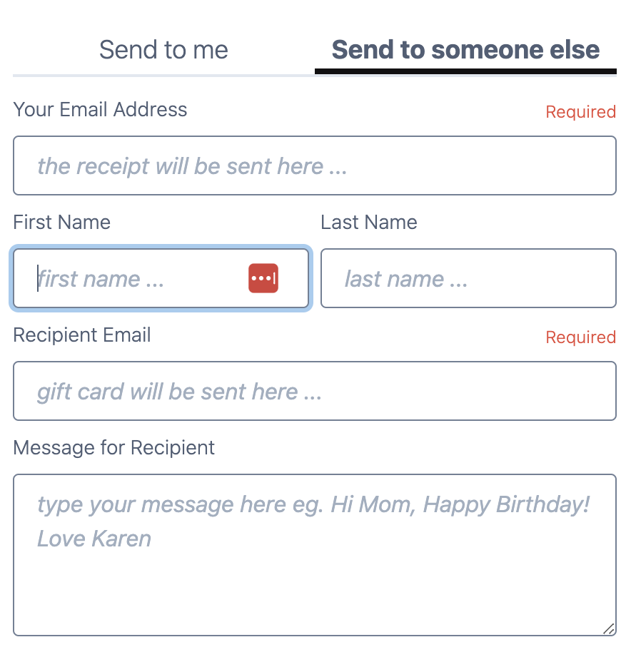
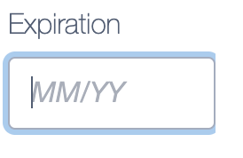
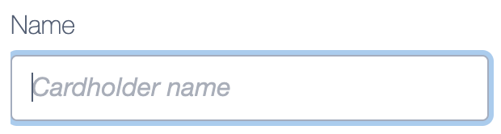
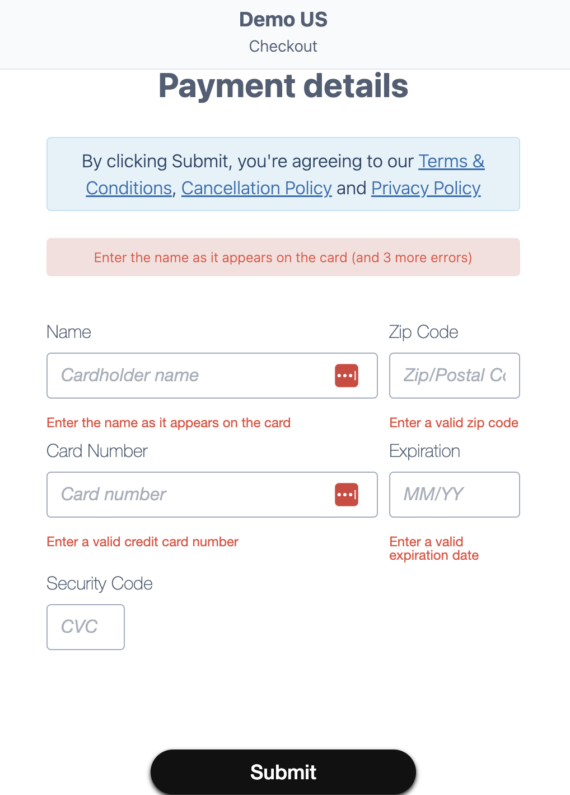

# Test automation framework for Phorest salon software demo

I built this test automation framework to demonstrate my knowledge and profession about how to build and set up a solid test automation framework from scratch using Cypress.

# Test architecture approach

I choosed Cypress with Javascript because it is easy and fast to setup and integrate with the picked CI tool and mail checking service. My test cases are E2E test scenarios which means I going through different test case scnenario flows from the beginning to the end.
I write test cases as it would be used as test automation regression pack. I think the main purpose to use test automation is not to find new bugs but get confidence about the working of the software. Instead of finding new bugs the main goal is to cover the main E2E process flow and ensure that it is working correctly. With keep this in mind I didn't write test cases for field validations and negative tests, etc.

Cypress offers a much more opportunity which I didn't used. For example:
* Reporting tool
* Artifact on CI server which creates downloadable test result reports
* There is a possibility to use a business layer using the Cucumber framework which is a BDD tool where we can write the testcases in human readable format
* Checking additional email details

Cypress offers a premade folder system but on the top of it there is the opportunity to organize our code as we would like:
* I created one test file where I wrote the tests (buyAGiftCard.cy.js)
* As most of the test are doing almost the same with different test data I created:
    * Commands which I use often (commands.js)
    * A constans file from where I can reach out test data (constans.js)
* I followed the POM approach:
    * Page Object Model (POM) is a design pattern, popularly used in test automation that creates Object Repository for web UI elements. The advantage of the model is that it reduces code duplication and improves test maintenance (langingPage.js, summaryPage.js, etc.)
    * Separate elements in one place
    * In this way if we want to change or maintain element locations, it is easier to change at only one place

# Identified automated test scenarios:

* Pay $50 for me
* Pay $100 for me
* Pay $150 for me
* Pay other amount for me - $222
* Pay $50 for someone else
* Pay $100 for someone else
* Pay $150 for someone else
* Pay other amount for someone else - $222
* Check email sending is working

# CI integration

I used Circle CI to set up a pipeline in the cloud and run the test from there. The pipeline is triggered each time there is a new code pushed into the repository.
* Steps to set up Circle CI:
    * Register myself into the Circle CI website
    * Create new project and connect my CI project to my Github repository
    * Create an SSH key pair with the following command on my local machine "ssh-keygen -t ed25519 -C email@example.com"
        * Give my Private SSH key to my Circle CI projecy
        * Add deploy key to my Github repositoty (Github Repository/Settings/Deploy keys)
    * Allow Uncertified Orbs: Settings/Security/Allow Uncertified Orbs -> Yes
    * Under the .circleci/config.yml I fill out the proper configuration
    * I do a code push into my repository

## CI test result

* Pipeline on Circle CI:

* Test result on Circle CI:

# Checking email was delivered

For this service I used Mailosar [link](https://mailosaur.com/)

Mailosaur is email testing software that lets you capture and test email, helping you build, test and present your product. It has a 14 days of free trial version.
The Mailosaur offer different mailing servers and API-s for them. Thanks for this I can check whether the emails are arrived at the mail servers with the predefined mail subject or not.

* Steps to set up Mailosaur:
    * Sign up on the official Mailosaur website
    * After the registration we get a server
    * I put my MAILOSAUR_API_KEY into the cypress.config.js file from the Mailosaur website
    * I give the serverID and Mailosaor email address to my tests
    * I used the given Mailosaur library to chceck email subject

Here I could see the arrived messages:

# Found bugs

Most of these bugs founded during manual testing and these are just non-functional issues which means the gift card buying process can go through with these as well.

* When I click on the 'Other' amount and click back to a specific amount the 'Required' or the 'The minimum spend is €25 and the maximum spend is $1000.' message is still there:

* First Name input field:
    * There is no length limitation
    * There is no 'required field' message
    * If I type too much character(200-300) the Checkout button will be inactive
* Last Name input filed:
    * There is no length limitation
    * There is no 'required field' message
    * If I type too much character(200-300) the Checkout button will be inactive

* At the payment step when I fill out the input fields the blueish borders are not covering the the input field perfectly

* At the payment step when I miss the CVC number and click on the Submit button I didn't get back required field message:

# How to perform tests

0. Install cypress to the used machine
1. Fork the project from github
2. Running tests:
    * Use cypress desktop runner or
    * From the cypress root folder we can type "npx cypress run" in the terminal to run the tests in command line
3. If there is no cpress xpath and mailosaur node module installed to our machine we can install it when we type it into the terminal:
    * npm install -D cypress-xpath
    * npm i -D mailosaur
    * npm i -D cypress-mailosaur

# Used Technology

* Cypress [link](https://www.cypress.io/)
* JavaScript
* Visual Studio Code
* Github
* Circle CI [link](https://circleci.com/)
* Mailosaur [link](https://mailosaur.com/)
* Additional modules installed:
    * cypress xpath: [link](https://www.npmjs.com/package/cypress-xpath?activeTab=readme)
    * mailosaur: [link](https://www.npmjs.com/package/mailosaur)
    * cypress-mailosaur [link](https://www.npmjs.com/package/cypress-mailosaur)